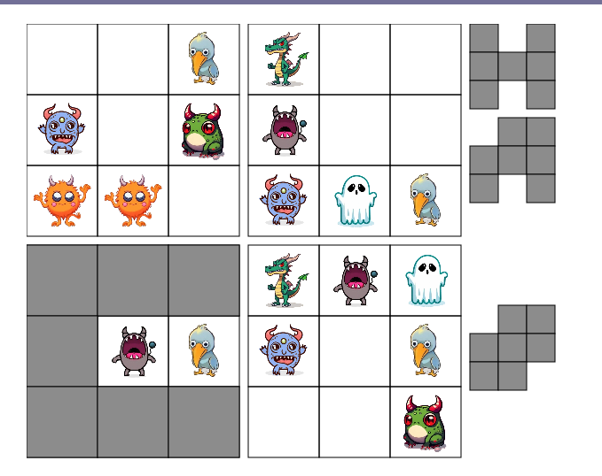

# Solveur Monstres Sous Le Lit



Ce projet est une application web interactive qui permet de jouer au puzzle *Monstres Sous Le Lit*, de générer de nouveaux défis, et de les résoudre automatiquement grâce à des modèles de contraintes écrits en **PyCSP3**. Le projet combine un frontend en **Vue.js** et un backend en **Python** pour la logique de résolution et de génération.

---

## À propos

*Monstres Sous Le Lit* est un puzzle logique où le joueur doit placer des monstres sous des objets en respectant des contraintes (forme des objets et nombre de monstres visibles de chaque type).
Chaque niveau est unique.
Ce projet permet de:
- **Jouer** à des puzzles existants.
- **Générer** de nouveaux puzzles aléatoires.
- **Résoudre** automatiquement les puzzles grâce à des algorithmes de satisfaction de contraintes.

Si vous souhaitez jouer au jeu réel, vous pouvez l'acheter à l'adresse suivante:
<br>
https://www.smartgames.eu/fr/jeux-pour-1-joueur/monstres-sous-le-lit

---

Les modèles du solveur PyCSP3 sont situés dans backend/scriptPySCP3

## Installation

1. **Cloner le dépôt**
   ```bash
   git clone https://github.com/ton_utilisateur/Solveur_Monstres_Sous_Le_Lit.git
   cd Solveur_Monstres_Sous_Le_Lit
   ```

2. **Cloner les dépendances**
   ```bash
   npm install -g @vue/cli --verbose
   npm install
   ```

4. **Configurer votre environnement Python** (ici dans notre environnement Jupyter notebook)
   ```bash
   python -m venv ~/solveur_env
   source ~/solveur_env/bin/activate
   pip install pycsp3
   ```

5. Enfin, lancez les commandes suivantes dans deux terminaux séparés:
   ```bash
   ./launchBackend.sh
   ./launchFrontend.sh
   ```

6. Allez sur  http://localhost:8080 avec votre navigateur


Illustrations du projet disponible dans screenshots/
